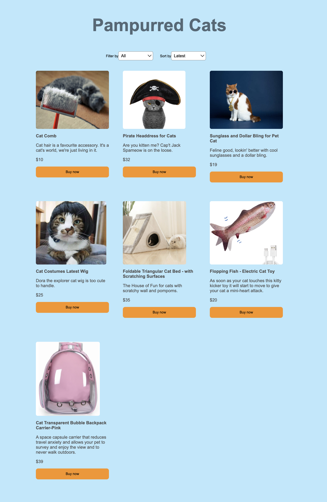

# 01 Project - Pampurred Cats Online Shop

## Brief

A Pampurred Cats is an online shop that sells cat accessories and costumes. You need to add products via Stripe and use React components for coding. You can also add functionality for the website such as Navigation Bar, Logo, etc.

## Getting Started

1. Open the project in VS code, and open your terminal

2. Type: `npm install` and then `npm start`. The React Application should open in your browser

3. Open `src/App.js` in VS Code.

# Setup Stripe Account

Watch the walkthrough video for setting up a new Stripe account: [Setup a Stripe account](https://www.loom.com/share/e862bc3d5c674203af78ec4d45430403)

1. Sign up for an account on [Stripe.com](https://stripe.com/nz). Use your email address.
2. Verify your email address
3. Enter a name for your company
4. Create a test store, and ensure you can see the API Keys

# Setup Stripe Account

Watch the tutorial for setting up a new Stripe account: [Setup a Stripe account](https://www.loom.com/share/e862bc3d5c674203af78ec4d45430403)

1. Sign up for an account on [Stripe.com](https://stripe.com/nz). Use your email address.
2. Verify your email address
3. Enter a name for your company
4. Create a test store, and ensure you can see the API Keys

# Create products in Stripe

Watch the [Adding products in Stripe](https://www.loom.com/share/16e40fb713554338adeedc72cc3eaefb) tutorial

## Acceptance criteria

- [ ] Have as much cat products as you like that are created in Stripe
- [ ] Each product has the category set in the `metadata`
- [ ] Each product has a one time price associated with it

---

# Shop design and CSS

Add a design for the shop using CSS. You should add your styles into `src/App.css`

## Dependencies

This project uses the following systems to work properly:

- [Stripe](https://stripe.com/nz)
- [Begin](https://ci.begin.com/)
- [React](https://react.dev/)

### Prerequisites

- [Node](https://nodejs.org/en)

[View the project instructions](PROJECT-INSTRUCTIONS.md)
